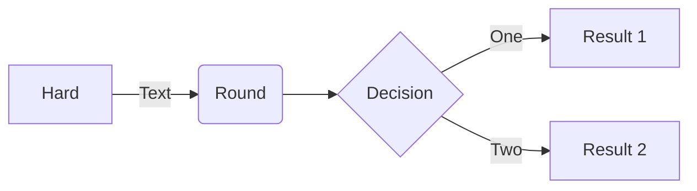
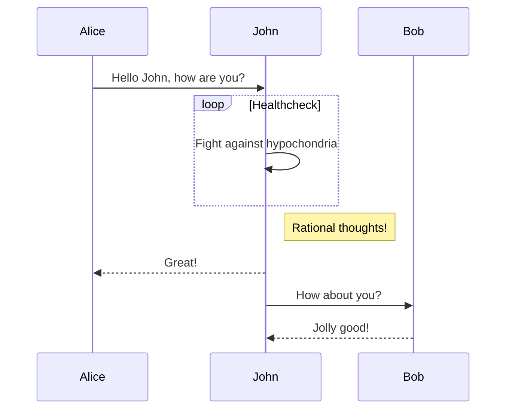
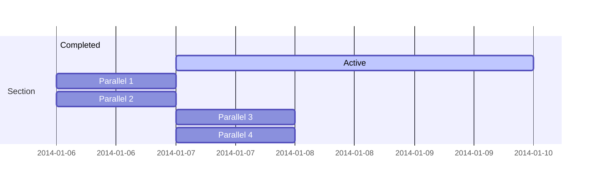
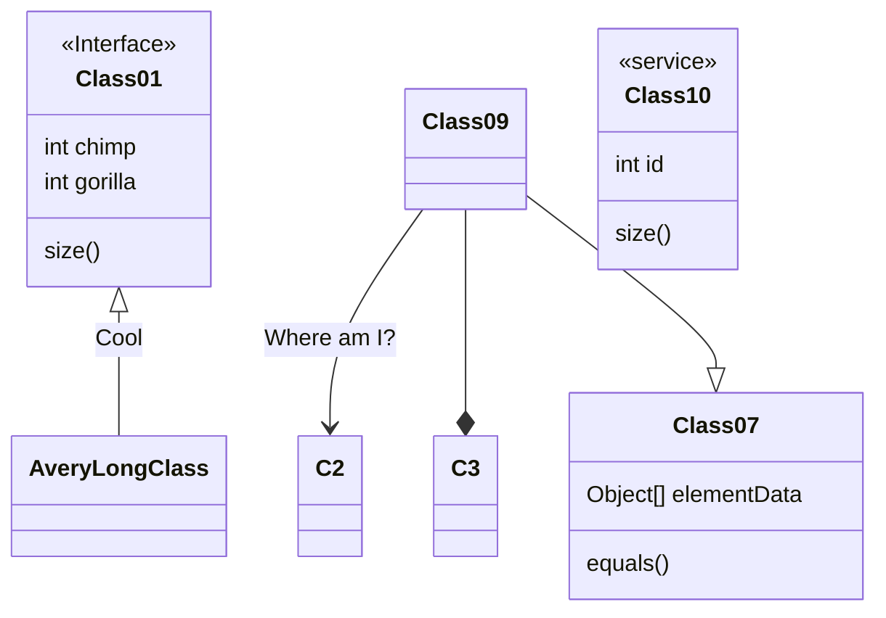
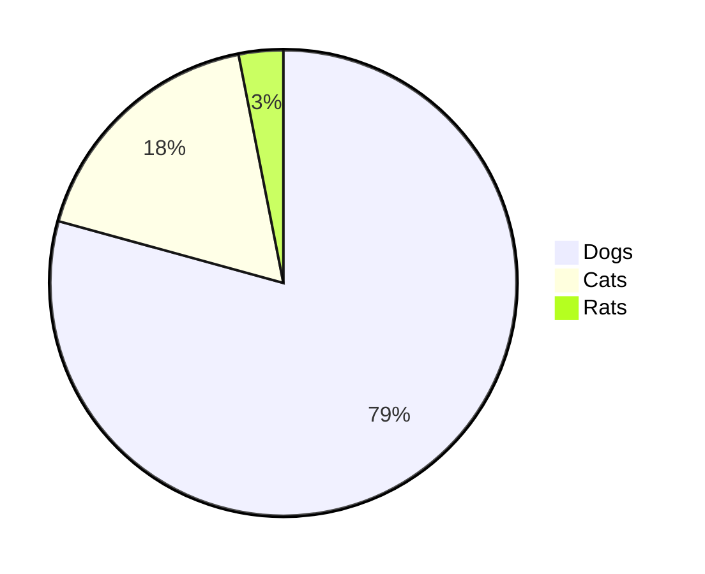
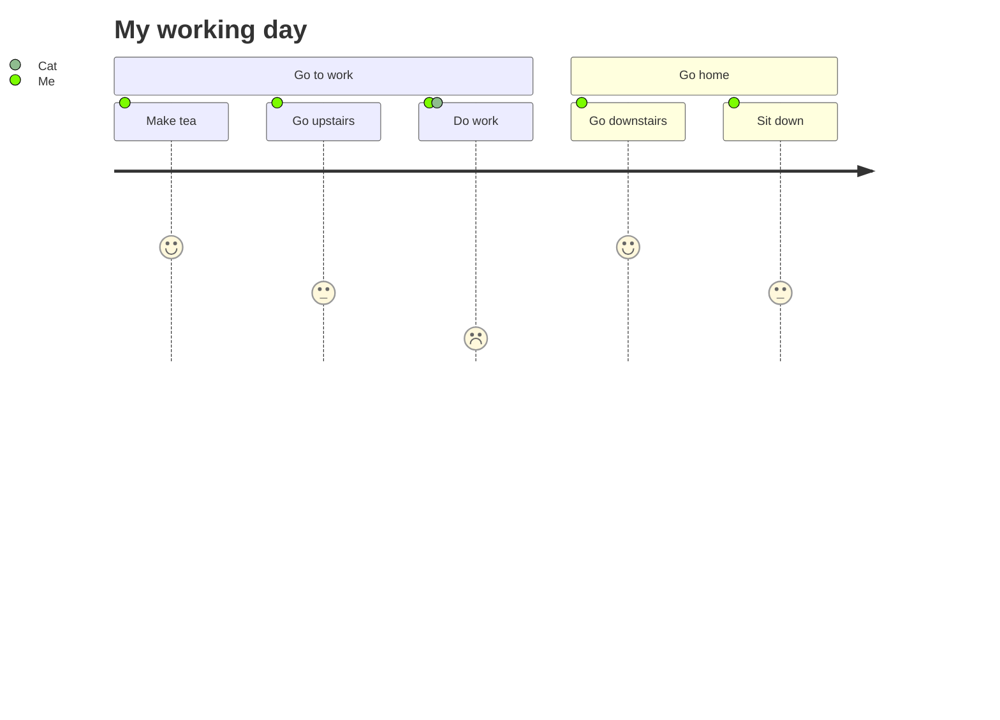
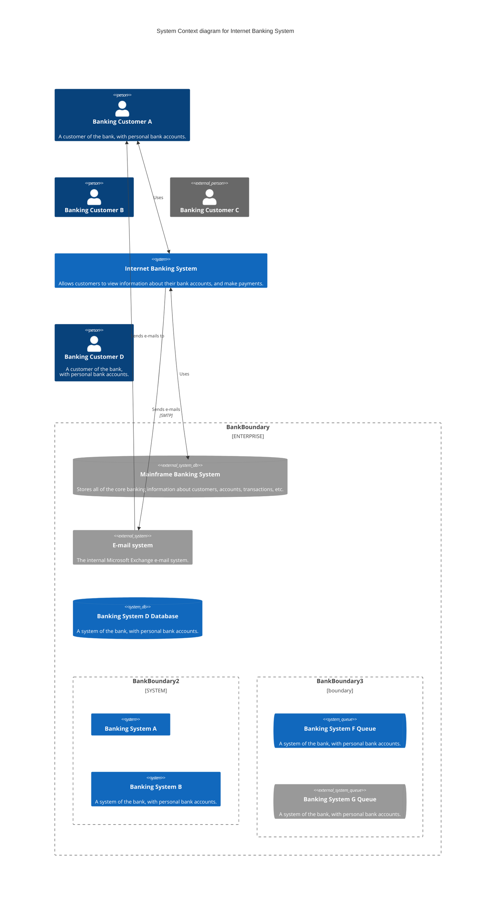

```mermaid
gantt
    title Git Issues - days since last update
    dateFormat  X
    axisFormat %s

    section Issue19062
    71   : 0, 71
    section Issue19401
    36   : 0, 36
    section Issue193
    34   : 0, 34
    section Issue7441
    9    : 0, 9
    section Issue1300
    5    : 0, 5
```

https://docs.ros.org/en/api/rtabmap_msgs/html/msg/MapGraph.html

Header header
```
##
# /map to /odom transform
# Always identity when the graph is optimized from the latest pose.
##
geometry_msgs/Transform mapToOdom

# The poses
int32[] posesId
geometry_msgs/Pose[] poses

# The links
Link[] links
```

https://docs.ros.org/en/api/rtabmap_msgs/html/msg/MapData.html

```
std_msgs/Header header
rtabmap_msgs/MapGraph graph
rtabmap_msgs/NodeData[] nodes
```

https://docs.ros.org/en/api/geometry_msgs/html/msg/Transform.html

```
geometry_msgs/Transform mapToOdom

geometry_msgs/Vector3 translation
geometry_msgs/Quaternion rotation


geometry_msgs/Pose pose
# request
string base_frame
---
# response
geometry_msgs/Pose pose
https://index.ros.org/p/ros_gz_bridge/#humble
ros_gz_bridge package from ros_ign repo
```



















ros2 doctor

ros2 doctor
/opt/ros/humble/lib/python3.10/site-packages/ros2doctor/api/package.py: 112: UserWarning: slam_toolbox has been updated to a new version. local: 2.6.5 < latest: 2.6.6

All 5 checks passed
